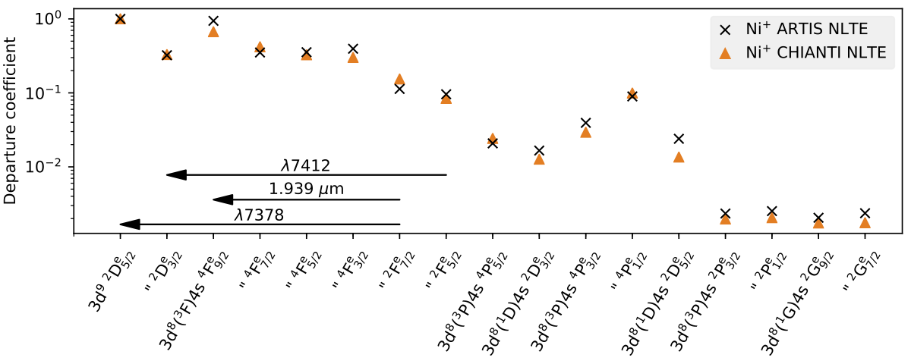
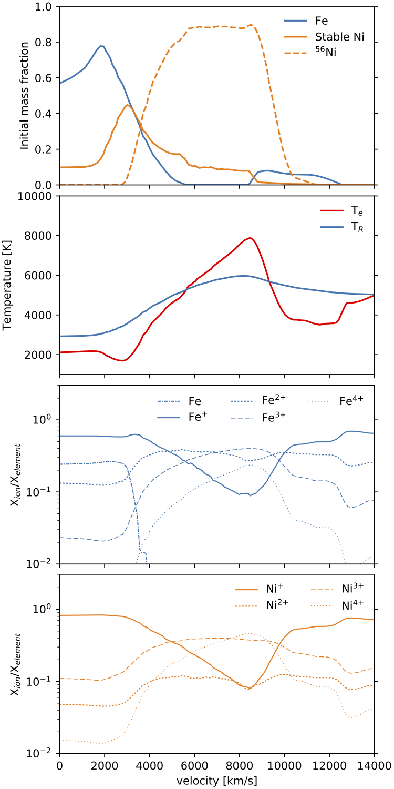

# Artistools

> Artistools is collection of plotting, analysis, and file format conversion tools for the [ARTIS](https://github.com/artis-mcrt/artis) radiative transfer code.


[](https://codecov.io/gh/artis-mcrt/artistools)
[](https://www.codefactor.io/repository/github/artis-mcrt/artistools)

## Installation
First clone the repository, for example:
```sh
git clone https://github.com/artis-mcrt/artistools.git
```
Then from within the repository directory run:
```sh
python3 -m pip install -e .
```

## Usage
Type "artistools" at the command-line to get a full list of commands. The most frequently used commands are:
  - plotartisestimators
  - plotartislightcurve
  - plotartisnltepops
  - plotartisnonthermal
  - plotartisradfield
  - plotartisspectrum

Use the -h option to get a list of command-line arguments for each command. Most of these commands would usually be run from within an ARTIS simulation folder.

## Example output





## Meta

Distributed under the MIT license. See ``LICENSE`` for more information.

[https://github.com/artis-mcrt/artistools](https://github.com/artis-mcrt/artistools)


